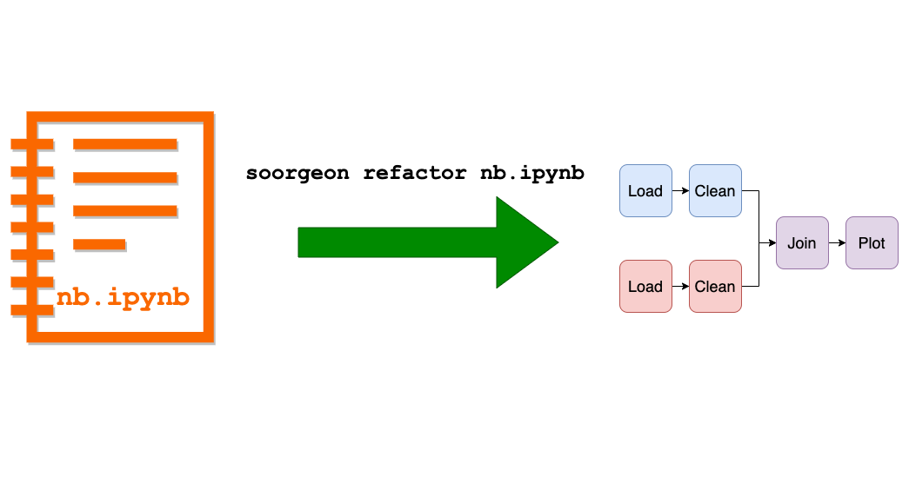

# Soorgeon

<p align="center">
  <a href="https://ploomber.io/community">Join our community</a>
  |
  <a href="https://www.getrevue.co/profile/ploomber">Newsletter</a>
  |
  <a href="mailto:contact@ploomber.io">Contact us</a>
  |
  <a href="https://ploomber.io/">Blog</a>
  |  
  <a href="https://www.ploomber.io">Website</a>
  |
  <a href="https://www.youtube.com/channel/UCaIS5BMlmeNQE4-Gn0xTDXQ">YouTube</a>
</p>




Convert monolithic Jupyter notebooks into [Ploomber](https://github.com/ploomber/ploomber) pipelines.

https://user-images.githubusercontent.com/989250/150660392-559eca67-b630-4ef2-b660-4f5ddb5a8d65.mp4

[3-minute video tutorial](https://www.youtube.com/watch?v=EJecqsZBr3Q).

Try the interactive demo:

<p align="center">
  <a href="https://mybinder.org/v2/gh/ploomber/binder-env/main?urlpath=git-pull%3Frepo%3Dhttps%253A%252F%252Fgithub.com%252Fploomber%252Fprojects%26urlpath%3Dlab%252Ftree%252Fprojects%252Fguides/refactor%252FREADME.ipynb%26branch%3Dmaster">  </a>
</p>


*Note: Soorgeon is in alpha, [help us make it better](CONTRIBUTING.md).*

## Install

```sh
pip install soorgeon
```

## Usage

### Refactoring

```sh
# refactor notebook
soorgeon refactor nb.ipynb

# all variables with the df prefix are stored in csv files
soorgeon refactor nb.ipynb --df-format csv
# all variables with the df prefix are stored in parquet files
soorgeon refactor nb.ipynb --df-format parquet

# store task output in 'some-directory' (if missing, this defaults to 'output')
soorgeon refactor nb.ipynb --product-prefix some-directory

# generate tasks in .py format
soorgeon refactor nb.ipynb --file-format py
```

To learn more, check out our [guide](doc/guide.md).

### Cleaning

Soorgeon has a `clean` command that can apply [black](https://github.com/psf/black) and [isort](https://github.com/PyCQA/isort) for `.ipynb` and `.py` files:

```
soorgeon clean path/to/notebook.ipynb
```

or

```
soorgeon clean path/to/script.ipynb
```

## Examples

```sh
git clone https://github.com/ploomber/soorgeon
```

Exploratory daya analysis notebook:

```sh
cd soorgeon/examples/exploratory
soorgeon refactor nb.ipynb

# to run the pipeline
pip install -r requirements.txt
ploomber build
```

Machine learning notebook:

```sh
cd soorgeon/examples/machine-learning
soorgeon refactor nb.ipynb

# to run the pipeline
pip install -r requirements.txt
ploomber build
```

To learn more, check out our [guide](doc/guide.md).

## Community

* [Join us on Slack](https://ploomber.io/community)
* [Newsletter](https://www.getrevue.co/profile/ploomber)
* [YouTube](https://www.youtube.com/channel/UCaIS5BMlmeNQE4-Gn0xTDXQ)
* [Contact the development team](mailto:contact@ploomber.io)
