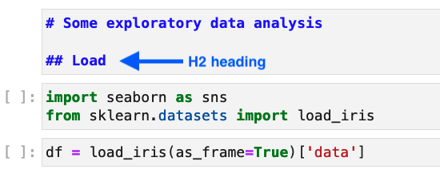
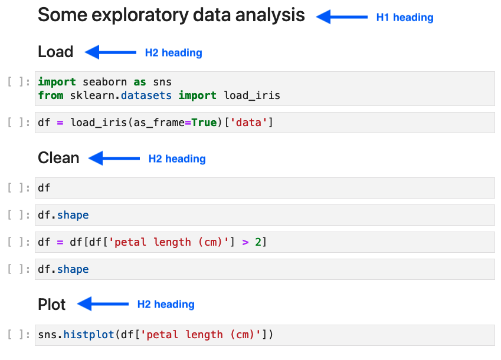

# Soorgeon guide

Soorgen has a single command:

```sh
soorgeon refactor path/to/nb.ipynb
```

The output is a [Ploomber](https://github.com/ploomber/ploomber) pipeline comprised of three elements:

1. `pipeline.yaml`: Pipeline specification (source code, inputs, outputs).
2. `tasks/`: A folder with tasks generated from each section in the input notebook
3. `exported.py`: Functions and classes exported from the original notebook, if any.

## Example

```sh
# install packages
pip install soorgeon ploomber

# get the example's code
git clone https://github.com/ploomber/soorgeon

# refactor the sample ML notebook
cd examples/machine-learning
soorgeon refactor nb.ipynb

# run the auto-generated Ploomber pipeline
ploomber build
```

## How it works?

### Notebook splitting

When refactoring a notebook, Soorgeon uses H2 Markdown headings to determine the splits among tasks:

H2 headings are prefixed by two hash characters `##`:



For example, say your notebook looks like this:



Soorgeon will create a pipeline with three tasks from this notebook:

1. `load.ipynb`
2. `clean.ipynb`
3. `plot.ipynb`

While Soorgeon automates the refactoring process, it's a good idea to edit your markdown headings, so the generated output pipeline has tasks of reasonable size: not too small as to be trivial but not too large to do many things at once.


You may also tell Soorgeon to create tasks in `.py` format:

```sh
soorgeon refactor path/to/nb.ipynb --file-format py
```

*Note: while the outputs are `.py` files, you can still open them as notebooks thanks to the integration with Jupyter. On JupyterLab do `Right-click` -> `Open with` -> `Notebook`*.


### Input/Output detection

After splitting, Soorgeon needs to determine dependencies among sections; following our current example (image above), you can see that `Load` exposes a `df` variable, then `Clean` uses it and modifies it, finally, `Plot` uses `df` to create a chart.

Soorgeon automatically finds these input/output dependencies and determines the order of execution. In this case, it is simple (`Load` -> `Clean` -> `Plot`), but real-world notebooks will have a more complex dependency structure.

### Input/Output serialization

Since the output notebook now contains many small `.py` files, it needs a way to communicate the outputs of any given task, so they are used as inputs for the next one. Following our example, `Load` needs to save `df` and `Clean` needs to load it, modify it, and save it again.

To do so, Soorgeon automatically adds serialization (bottom cell) and unserialization (top cell) logic to each generated `.py` file.

For example, Soorgeon would add the following serialization cell at the bottom of `Load`:

```python
# save df
Path(product['df']).write_bytes(pickle.dumps(df))
```

And the following unserialization cell at the top of `Clean`:

```python
# load df
df = pickle.loads(Path(product['df']).read_bytes())
```
To learn more about Ploomber pipelines, check out our [introductory tutorial.](https://docs.ploomber.io/en/latest/get-started/spec-api-python.html)

**Important:** Since Soorgeon only analyses your code *statically*, that is, it doesn't execute it but only parses the source code, it doesn't know if a variable `df` is a data frame or something else. Hence it uses the `pickle` module, a flexible method for serializing a wide range of object types; however, we highly recommend you change the output format once you finish with the refactoring process (`.parquet` is an excellent format for data frames).

### Customizing output format

You can pass the `--df-format` option to customize how data frames are serialized/unserialized:

```sh
# all variables with the df prefix are stored in csv files
soorgeon refactor nb.ipynb --df-format csv

# all variables with the df prefix are stored in parquet files
soorgeon refactor nb.ipynb --df-format parquet
```

Any variable that *do not* have the `df` prefix are serialized with `pickle`.

You can pass the `--serializer` option to specify serializer to be used if variable cannot be serialized by `pickle`. Currently two serializers are supported : `cloudpickle` and `dill`.
soorgeon refactor nb.ipynb --serializer dill
soorgeon refactor nb.ipynb --serializer cloudpickle


### Exporting functions and classes

Finally, any function or class definitions:

```python
def my_function():
    pass

class MyClass:
    pass
```

Are exported to an `exported.py` file and imported in any task that needs them. Keeping function and class definitions in a separate file is a good practice since it allows us to use them in multiple places and write unit tests.

## Running the pipeline

Once the refactoring process finishes, you can interact with it as any other Ploomber pipeline. Try out the following commands:

```sh
# install ploomber
pip install ploomber

# print a summary
ploomber status

# generate a diagram
ploomber plot

# build pipeline
ploomber build
```

## Known limitations

* If a function depends on global variables, [manual editing is required](fn-global.md).
* Star imports are not supported (e.g., `from math import *`), see [fixing star imports](star-imports.md) for details.
* Variables required from one task to the next one should be pickable (i.e., `pickle.dumps(obj)` should work)

## Questions?

If you have any questions, feel free to [open an issue](https://github.com/ploomber/soorgeon/issues/new) or join us on [Slack.](https://ploomber.io/community)
